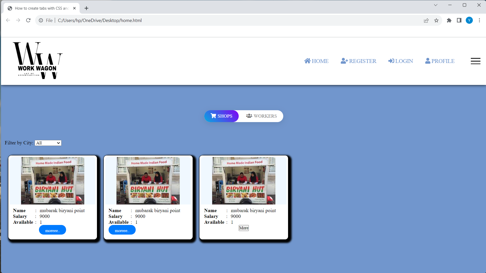
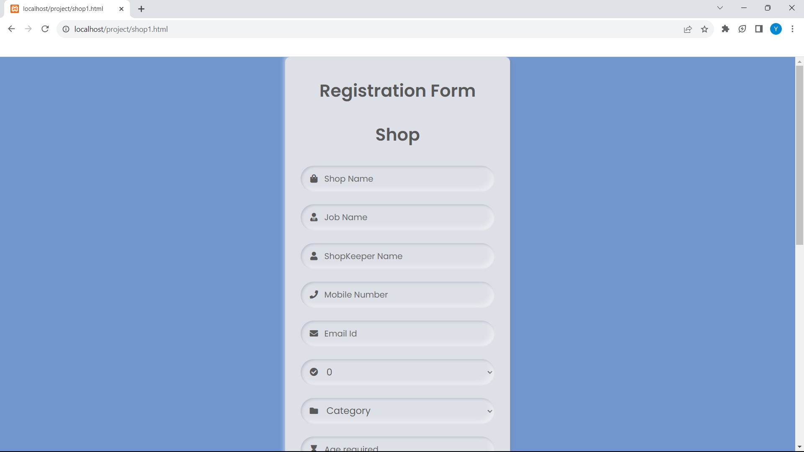
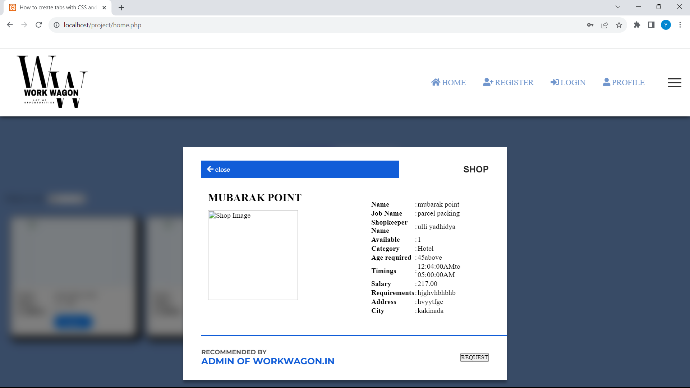

# 🚚 Work Wagon

**Work Wagon** is a comprehensive web-based platform designed to seamlessly connect job seekers (*Workers*) with job providers (*Shops*). It streamlines local workforce management with efficient job matching, secure data handling, and real-time status tracking.

---

## 🌟 Key Features

- **🏠 Home Page**  
  A welcoming entry point with intuitive navigation to all major sections.

- **🔐 User Registration & Login**  
  Separate, role-based authentication systems for Workers and Shops.

- **💼 Job Matching & Requests**  
  Simple and clean interfaces to initiate, request, and manage job postings and applications.

- **🛡️ Security & Accessibility**  
  Ensures user data protection and inclusive access for all users.

---

## 🖥️ Screenshots

> 📸 Replace these with your actual image URLs (uploaded to GitHub or elsewhere)

|  |  |
|------------------------------------|--------------------------------------------------|
|  |  |

|  |  |
|--------------------------------------------------------|------------------------------------------|

---

## 🛠️ Tech Stack

- **Frontend:** HTML, CSS, JavaScript  
- **Backend:** PHP (for user auth and handling requests)  
- **Database:** MySQL (for user and job data management)

---

## 🚀 How to Run Locally

```bash
# 1. Clone the repo
git clone https://github.com/yourusername/work-wagon.git

# 2. Move into the project directory
cd work-wagon

# 3. Place it in your XAMPP/WAMP/LAMP htdocs folder

# 4. Start Apache & MySQL from your local server (e.g., XAMPP Control Panel)

# 5. Import the SQL file into phpMyAdmin

# 6. Open your browser and go to:
http://localhost/work-wagon/home.php
